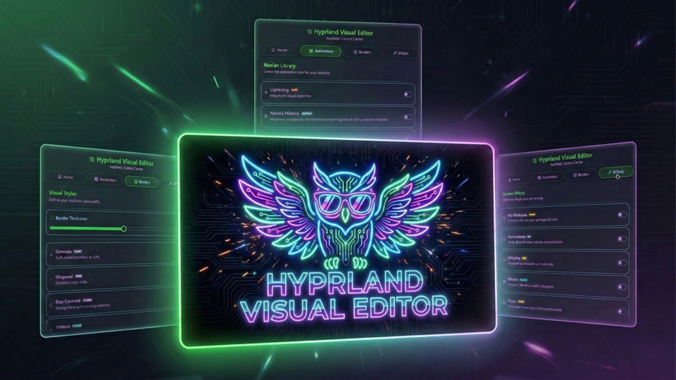

<p align="center">

</p>

# 🦉 Hyprland Visual Editor (HVE)

### Dynamic Visual Control for Hyprland Customization

**Hyprland Visual Editor** is a professional-grade, non-destructive customization ecosystem for **Hyprland**, built as a native plugin for **Noctalia Shell**. It allows you to instantly change animations, borders, shaders, and geometry, without any risk of corrupting your main `hyprland.conf`.

---

## ✨ Key Features

| Feature | Description |
| --- | --- |
| **🛡️ Guardian Shield** | Deploys a secure external path in `~/.cache/noctalia/HVE/`. If the plugin is disabled, the system self-cleans on reboot. |
| **⚡ Native Integration** | Uses the official Noctalia Plugin API (4.4.1+) for settings and state persistence. |
| **🎬 Motion Library** | Swap between animation styles (Silk, Cyber Glitch, etc.) in milliseconds. |
| **🎨 Smart Borders** | Dynamic gradients and reactive effects tied to window focus. |
| **🕶️ Real-Time Shaders** | Post-processing filters (CRT, OLED, Night) applied on the fly via GLSL. |
| **🌍 Native i18n** | Full multilingual support using Noctalia's native translation engine via `i18n/`. |

---

## 📂 Project Structure

To ensure maximum stability, HVE follows the official Noctalia plugin architecture:

```text
~/.cache/noctalia/
└── HVE/                        # 🛡️ THE SAFE REFUGE (Generated on activation)
    └── overlay.conf            # MASTER CONFIG: Sourced directly by Hyprland

~/.config/noctalia/plugins/hyprland-visual-editor/
    ├── manifest.json           # Plugin metadata and Entry Points
    ├── BarWidget.qml           # Entry Point: Taskbar trigger icon
    ├── Panel.qml               # Main UI & Tab management
    ├── Settings.qml            # Native Configuration UI
    │
    ├── modules/                # UI Components (QML)
    │   ├── WelcomeModule.qml   # Activation logic & Native Persistence
    │   ├── AnimationModule.qml # Motion selector
    │   ├── BorderModule.qml    # Style & Geometry selector
    │   └── ShaderModule.qml    # GLSL Filter selector
    │
    ├── assets/                 # The "Engine" & Resources
    │   ├── borders/            # Style library (.conf)
    │   ├── animations/         # Movement library (.conf)
    │   ├── shaders/            # GLSL Post-processing filters (.frag)
    │   └── scripts/            # Bash Engine (Logic and assembly)
    │
    ├── i18n/                   # Official Translation Files (.json)
    └── settings.json           # Native Persistence (Managed by Noctalia)
```

---

## 🚀 Installation

1. Open Noctalia Shell's **Settings** and navigate to the **Plugins** section.
2. Search for **Hyprland Visual Editor** and click **Install**.
3. Open the plugin panel from your topbar.
4. Go to the **Welcome** tab and click **Activate Persistence**.

> [!IMPORTANT]
> To enable the real-time effects, you must add `source = ~/.cache/noctalia/HVE/overlay.conf` to the end of your `hyprland.conf`. HVE will handle the rest!

---

## ⌨️ IPC & Keybinds (Pro Features)

HVE supports native IPC calls. You can toggle the panel with a Hyprland keybind:

```bash
bind = $mainMod, V, exec, qs -c noctalia-shell ipc call plugin:hyprland-visual-editor toggle
```

---

## 🧠 Technical Architecture

HVE uses a **dynamic construction** flow combined with Noctalia's native API:

1. **Native State:** All user preferences are handled via `pluginApi.pluginSettings`.
2. **Dynamic Scanning:** The `scan.sh` script extracts metadata from style headers in real-time.
3. **Assembly:** The engine unifies all active fragments into the external `~/.cache/noctalia/HVE/overlay.conf`.
4. **Protection:** The satellite file approach ensures that even if the plugin is uninstalled, your `hyprland.conf` remains intact.

---

## 🛠️ Modding Guide (Metadata Protocol)

HVE scans your asset folders dynamically. To add your own styles, use this header format:

### For Animations and Borders (`.conf`)

```ini
# @Title: My Epic Style
# @Icon: rocket
# @Color: #ff0000
# @Tag: CUSTOM
# @Desc: A brief description of your creation.

# Your Hyprland code here...
```

### For Shaders (`.frag`)

```glsl
// @Title: Vision Filter
// @Icon: eye
// @Color: #4ade80
// @Tag: NIGHT
// @Desc: Post-processing description.

void main() { ... }
```

---

## ⚠️ Troubleshooting

**How to see debug logs?**
Launch Noctalia from the terminal to see HVE specific logs using the native Logger:
```bash
NOCTALIA_DEBUG=1 qs -c noctalia-shell | grep HVE
```

**Border animations freeze?**
This is a known Hyprland behavior during hot-reloads of specific geometry settings. Re-focusing the window or opening a new one usually restores the looping effect.

---

## ❤️ Credits

* **Architecture & Core:** XimoCP
* **Technical Assistance:** Co-programmed with Gemini (AI)
* **Inspiration:** HyDE Project & JaKooLit.
* **Community:** Thanks to the Noctalia dev community.
